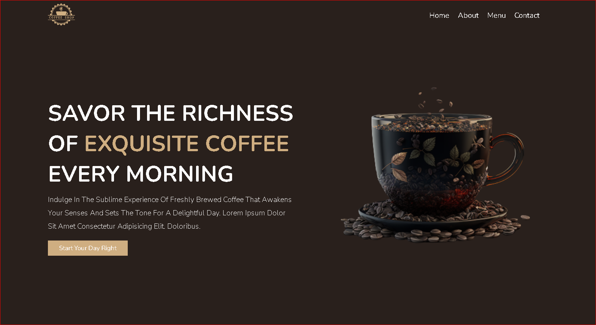

# Oasis Infobyte Internship - Task 1

## Project Overview

For this assignment, I designed a straightforward landing page dedicated to coffee. Using HTML, CSS, and JavaScript, I created a responsive website with a dynamic navigation menu and smooth animations.

The landing page showcases the charm of coffee through a simple and user-friendly design. From its elegant layout to interactive features, this project is a blend of creativity and technical know-how.

## Technologies Utilized

- **HTML**
- **CSS**
- **JavaScript**

## Preview

